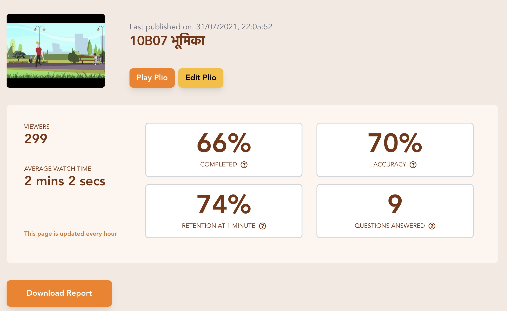

# What is Plio?

Plio is an open-source tool that unlocks the true potential of your videos. This tool enables you to make **ANY** YouTube video interactive by adding questions between the video. Questions are one of the many types of interaction that can be added to Plio.

<iframe width="100%" height="315" src="https://www.youtube.com/embed/ONG1J_PkGSE" title="YouTube video player" frameborder="0" allow="accelerometer; autoplay; clipboard-write; encrypted-media; gyroscope; picture-in-picture" allowfullscreen></iframe>

Our dashboard provides rich engagement data - even at the granularity of every user - to help you receive feedback and understand how to improve your videos in the future.

To try out the platform, please head over to [app.plio.in](https://app.plio.in)