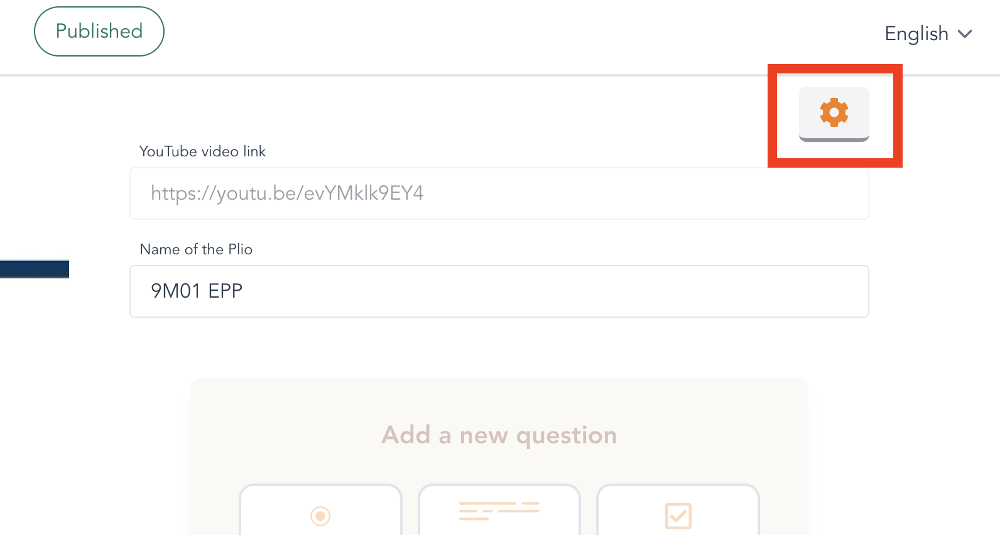
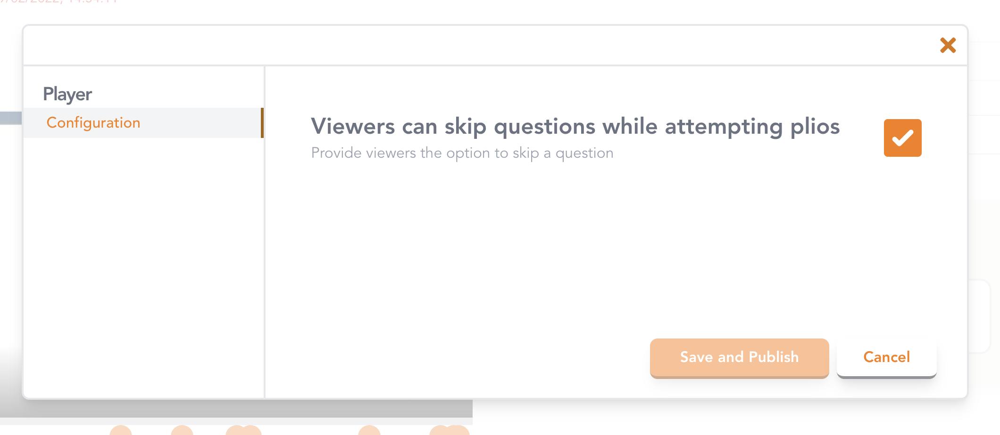
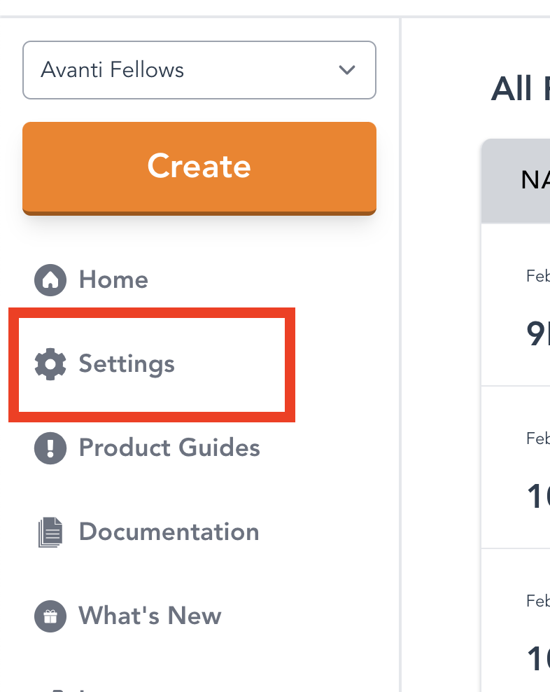
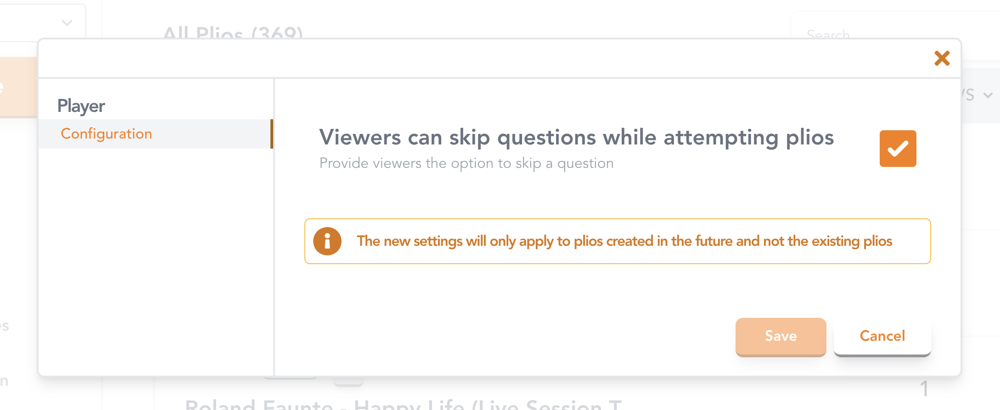

# Advanced

## Customising your Plios

You can choose to customize your plios as per your needs to override the default configuration. You can change the settings at the level of an individual plio as well as update the default settings for all your plios. For a team workspace, we provide access controls to ensure that only the admins can update the default settings. Read more about it [here](../plio-for-teams/#access-control-for-workspace-settings). These are the following settings that you can control right now (we'll be adding a lot more settings with time):
- Letting viewers skip questions while attempting plios

### Set the configuration for an individual plio
If you want to update the settings for an individual plio, open the Editor for that plio and click on the gear icon as shown in the image below:

Upon clicking, you'll see a settings menu which contains all the settings that you can change.

You can change any setting as you wish and press `Save` (for draft plios) or `Save and Publish` (for published plios). You can see your changes being reflected by either previewing the plio (for draft plios) or watching the plio yourself (for published plios).

### Set the default configuration for all your plios
It can become really tiresome to update the settings for every new plio that you create. Especially, if you are always changing the settings to the same values. That's why we enable you to set the default configuration for all your plios from your home page itself.

Navigate to the home page and click on the `Settings` button in the sidebar.

Upon clicking, you'll see the settings menu again. However, this time, your changes will be stored as the default configuration for all the plios that you create in the future.

::: warning

Note that these changes will NOT affect the settings of your existing plios. It will only be applicable for any NEW plios that you create.

:::