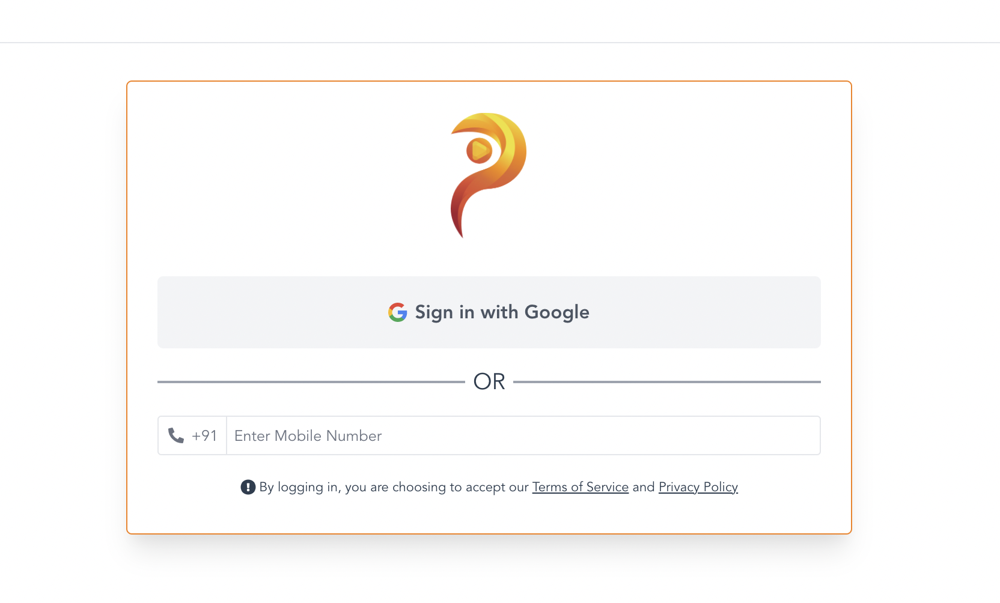
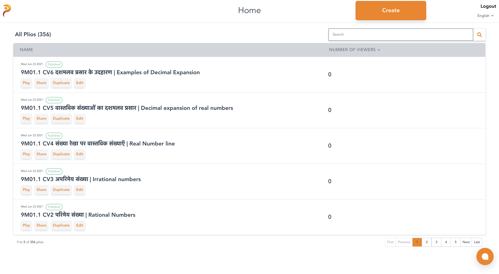
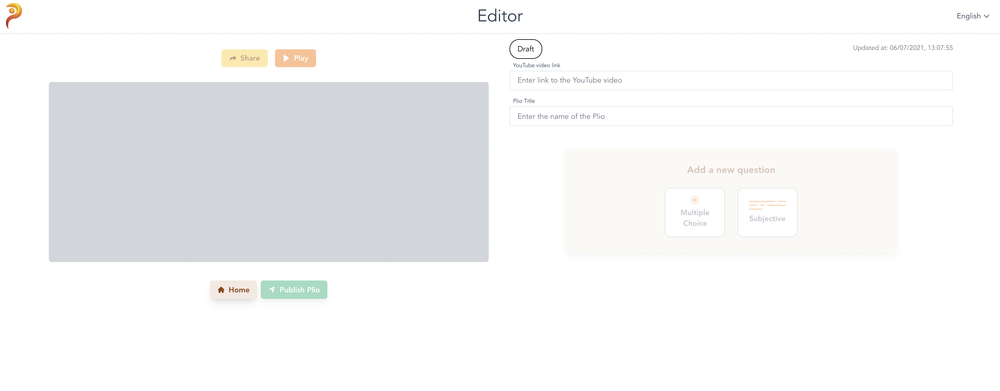

# Getting Started

## Authentication
Head over to [https://app.plio.in](https://app.plio.in).
You can login to the platform using Google or using your mobile number.

## Creating a plio
After logging in, you'll be redirected to the home page where you can see the plios that you have created.
An example homepage, with some listed plios can be seen below.

Watch this video to know more about the Plio Home.

<iframe width="100%" height="315" src="https://www.youtube.com/embed/jWdA2JFCxGw" title="YouTube video player" frameborder="0" allow="accelerometer; autoplay; clipboard-write; encrypted-media; gyroscope; picture-in-picture" allowfullscreen></iframe>

You can click the **Create** button to create a plio. You'll be redirected to the **Editor**. The editor will look like this.

Watch this video to know more about the Plio Editor.

<iframe width="100%" height="315" src="https://www.youtube.com/embed/vnISjBbrMUM" title="YouTube video player" frameborder="0" allow="accelerometer; autoplay; clipboard-write; encrypted-media; gyroscope; picture-in-picture" allowfullscreen></iframe>

## Watching a plio
After you've created and published your plio, you can share the plio's link to your viewers.
When your viewers click on the link, it will redirect them to the plio player on a browser where they can attempt the plio.

Watch this video to know more about the Plio Player.

<iframe width="100%" height="315" src="https://www.youtube.com/embed/3aVpkFaUoYA" title="YouTube video player" frameborder="0" allow="accelerometer; autoplay; clipboard-write; encrypted-media; gyroscope; picture-in-picture" allowfullscreen></iframe>

## Analysing a plio
After your plio has been watched and attempted by some viewers, you can start analysing the data that is being gathered from these viewers.
You can see the data gathered for a plio by heading back to the home page, hovering over the plio you're interested in and clicking the **Analyse** button.
This will redirect you to the Dashboard for that plio.

Watch this video to know more about the Plio Dashboard.

<iframe width="100%" height="315" src="https://www.youtube.com/embed/x448D44mOsw" title="YouTube video player" frameborder="0" allow="accelerometer; autoplay; clipboard-write; encrypted-media; gyroscope; picture-in-picture" allowfullscreen></iframe>

**Note** - The whole product guide is available in the form of videos [here](https://www.youtube.com/channel/UCpYqVAKRFG4hFCglzRyFiaQ/videos)