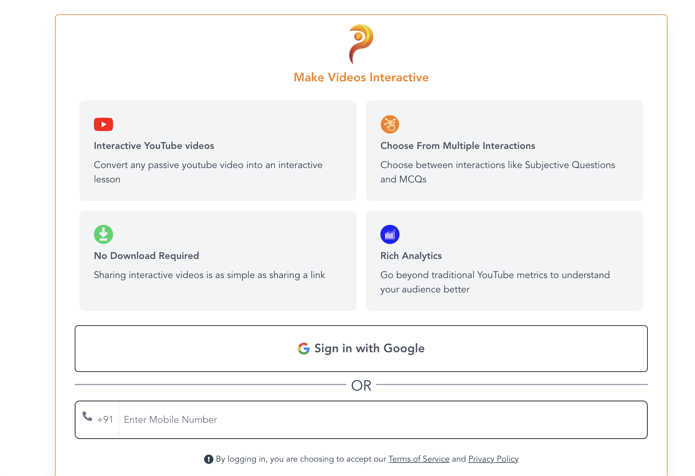
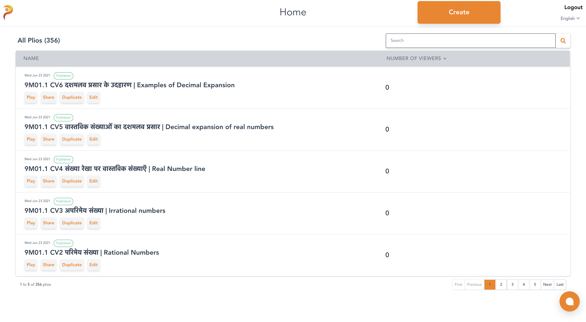
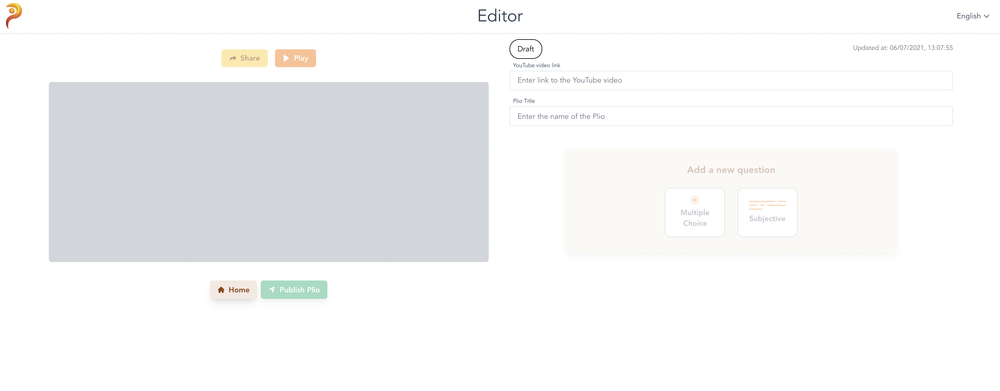
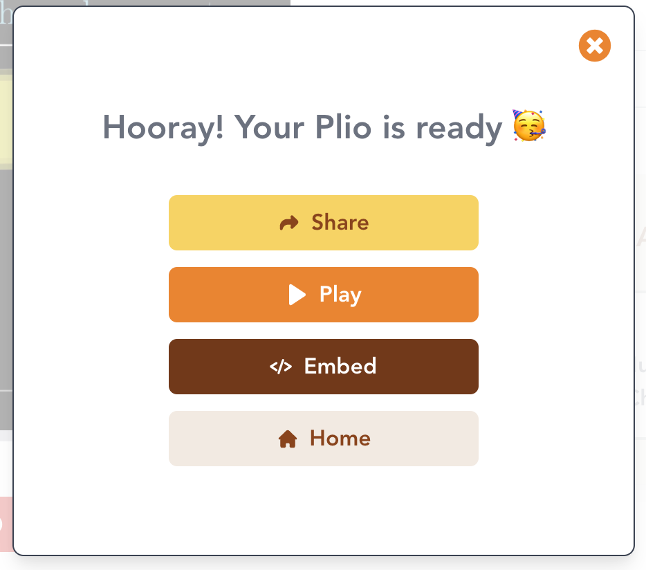
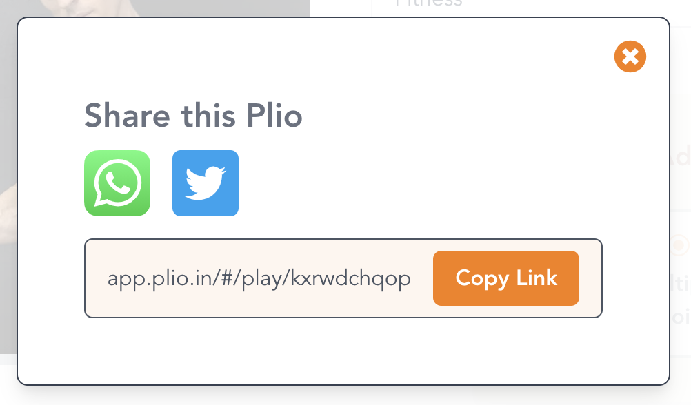
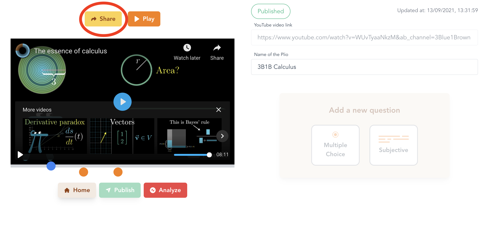
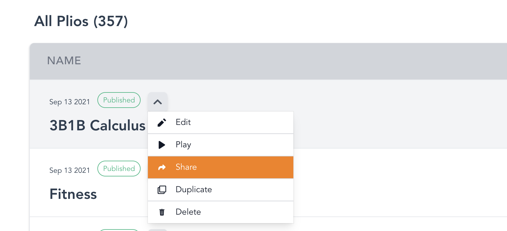
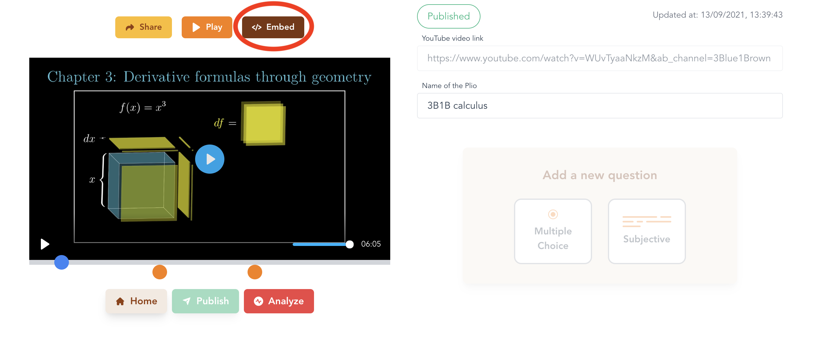

# Getting Started

## Authentication
Head over to [https://app.plio.in](https://app.plio.in).
You can login to the platform using your Google e-mail ID or mobile number.

## Creating a plio
After logging in, you'll be redirected to the home page where you can see the plios that you have created.
An example homepage, with some listed plios can be seen below.

::: tip

Watch this video to know more about the Plio Home.

:::

<iframe width="100%" height="315" src="https://www.youtube.com/embed/jWdA2JFCxGw" title="YouTube video player" frameborder="0" allow="accelerometer; autoplay; clipboard-write; encrypted-media; gyroscope; picture-in-picture" allowfullscreen></iframe>

You can click the **Create** button to create a plio. You'll be redirected to the **Editor**. The editor will look like this.

::: tip

Watch this video to know more about the Plio Editor.

:::

<iframe width="100%" height="315" src="https://www.youtube.com/embed/vnISjBbrMUM" title="YouTube video player" frameborder="0" allow="accelerometer; autoplay; clipboard-write; encrypted-media; gyroscope; picture-in-picture" allowfullscreen></iframe>

## Sharing a plio
After publishing a plio, you can share the link of the plio with your viewers. Once you hit `Publish`, you will see a `Share` button as shown below.

Upon clicking the `Share` button, you will get a pop-up containing the link which you can copy by clicking on `Copy Link`. You can also click on the icons below to share the link on the respective apps.

You can also come back later and share the link to the plio from both the Editor and the Home page:

## Embedding a plio
You can embed your plio on your own website too. Once you hit `Publish`, you will see an `Embed` button as shown below.

Upon clicking the `Embed` button, you will get a pop-up containing the embed code which you can copy by clicking on `Copy`.

You can simply add the copied embed code to your website and voilà, the plio will be embedded on your website. You can also come back later and find the embed code from the Editor by clicking on the `Embed` button shown below:

::: warning NOTE

In the default plan, you will not receive any data from the embedded plio if your viewers haven't already logged in to plio. You can fill [this](https://docs.google.com/forms/d/e/1FAIpQLSdSq3KZOTEAnNsE5BfRPNPpmROQQ3gPFYJS8xJ9RB2j5LsAQQ/viewform) form if you want to apply for an [organizational plan](../plio-for-teams) to [receive data using Single Sign-On (SSO)](../plio-for-teams/#receiving-data-from-embedded-plio).

:::

## Watching a plio
After you've created and published your plio, you can share the plio's link to your viewers.
When your viewers click on the link, it will redirect them to the plio player on a browser where they can attempt the plio.

::: tip

Watch this video to know more about the Plio Player.

:::

<iframe width="100%" height="315" src="https://www.youtube.com/embed/3aVpkFaUoYA" title="YouTube video player" frameborder="0" allow="accelerometer; autoplay; clipboard-write; encrypted-media; gyroscope; picture-in-picture" allowfullscreen></iframe>

## Analysing a plio
After your plio has been watched and attempted by some viewers, you can start analysing the data that is being gathered from these viewers.
You can see the data gathered for a plio by heading back to the home page, hovering over the plio you're interested in and clicking the **Analyse** button.
This will redirect you to the Dashboard for that plio.

::: tip

Watch this video to know more about the Plio Dashboard.

:::

<iframe width="100%" height="315" src="https://www.youtube.com/embed/x448D44mOsw" title="YouTube video player" frameborder="0" allow="accelerometer; autoplay; clipboard-write; encrypted-media; gyroscope; picture-in-picture" allowfullscreen></iframe>

::: tip

The whole product guide is available in the form of videos [here](https://www.youtube.com/channel/UCpYqVAKRFG4hFCglzRyFiaQ/videos).

:::