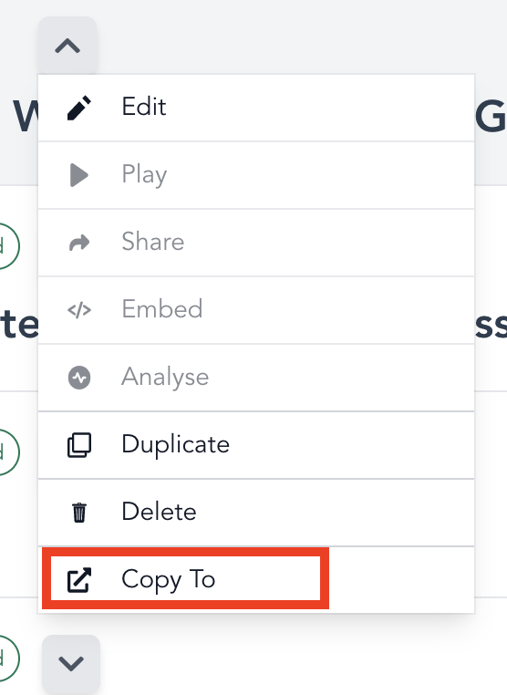

## Copy Plios from Personal Workspace

Sometimes, creators can create a plio in their personal workspace instead of the organizational workspace. Instead of having to repeat the creation step, creators can simply copy the plios in their personal workspace to the organizational one.

::: warning

Make sure that the creator who wants to copy the plio has already been added to the organizational workspace before proceeding ahead.

:::

1. On the home page, click on the dropdown for the plio that you want to copy.

2. You should see an option to copy the plio.

3. Open clicking `Copy To`, you should see a list of all the workspaces that you are a part of.

4. Choose the workspace you want to copy the plio to.
5. The chosen workspace will open up with the copied plio shown at the top.