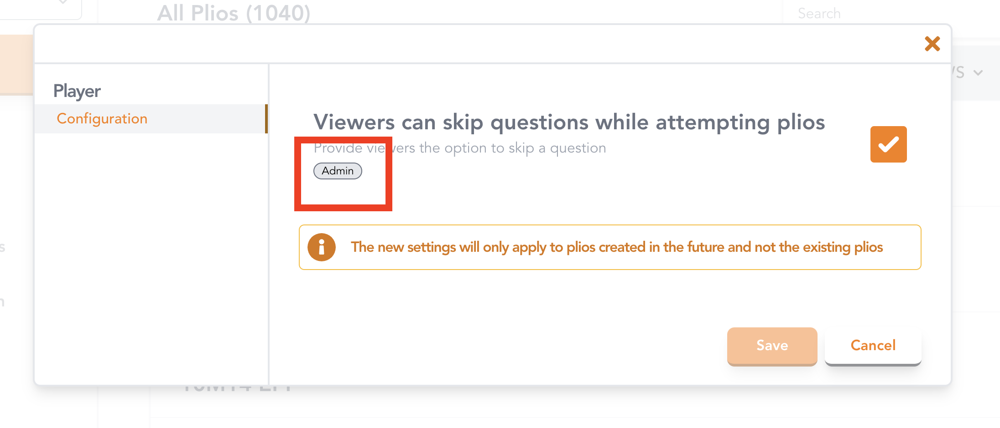

## Access control for workspace settings

We enable you to customize the configuration of your plios as given [here](../advanced/#customising-your-plios).

However, in a team workspace, you might want to control who can change the default configuration for your plios. Keeping that in mind, we have marked several settings to be accessible by the team admins only. Settings which can only be accessed by the workspace admins have been marked
as `Admin` as shown in the image below!

Every member of your workspace will still be able to change the [settings of an individual plio from the Editor](../advanced/#set-the-configuration-for-an-individual-plio).