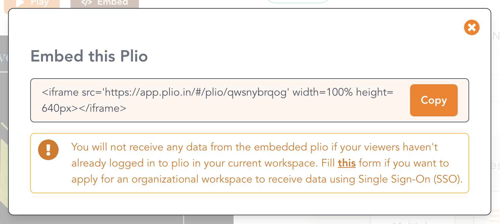
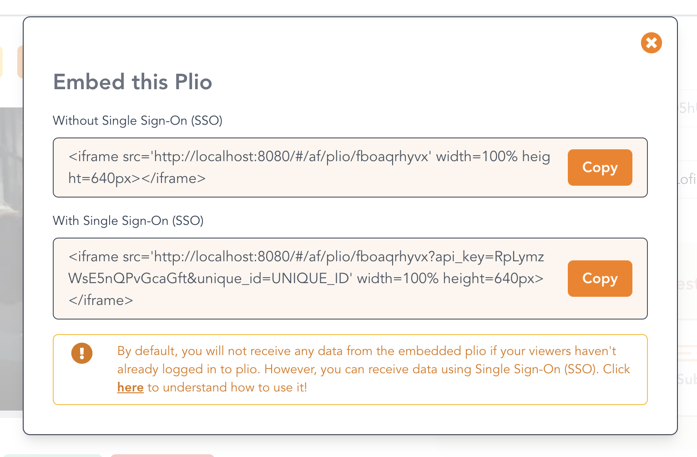

## Single Sign-On (SSO)

Your viewers can watch your plio using the link that you share with them. However, if someone is not already logged in to Plio, they will have to authenticate themselves first. Sometimes, this is not desirable as it can cause additional friction for your viewer and you might want them to directly watch the plio without having to log in.

Plio provides you with a way to do precisely that. You can do this using a unique **API Key** which is assigned to every organization. You will be provided with your API Key when your organizational workspace is created. 

::: danger

It is your responsibility to ensure that you don't share this API key with anyone or include it in any document that is publicly accessible.

:::

This is how a typical plio link looks like: 

```:no-line-numbers
https://app.plio.in/#/play/r7R7ErAy2a
```

To bypass plio's authentication, you need to add 2 parameters to the query:
- `unique_id`: this should be the unique identifier for your viewer
- `api_key`: this should be the API key that was shared with you as mentioned above

The modified link should look like:

```:no-line-numbers
https://app.plio.in/#/play/r7R7ErAy2a?unique_id=UNIQUE_ID&api_key=YOUR_API_KEY
```

You need to share this link with your viewers instead of the usual plio link and your viewers will be able to access the plio without having to authenticate.

There are two ways to use this feature:
- If you already have a user management system, you can simply pass in the unique ID for a viewer in your system as the `unique_id` parameter mentioned above.
- If you don't and simply want any viewer to bypass Plio's authentication, you can use any random value for `unique_id`. However, in this case, you won't be able to identify the users during analysis. 

### Receiving data from Embedded Plio

You can embed your plios in your website as shown [here](../getting-started/#embedding-a-plio), but, on the default plan, you will not receive any data from the embedded plio if your viewers haven't already logged in to plio. 

However, if you have an organizational workspace, you can use Single-Sign On (SSO). This will enable you to receive data from your users without them having to log in to plio. Let's see how!

This is what you typically see when you click the `Embed` button in the Editor:



However, in the organizational workspace, you will see two embed codes instead of one, as shown below:



The first embed code is the same as the one shown in the image before. The second embed code enables you to receive data from the embedded plio, even if the user has not logged in to Plio. This is done using SSO. In this case, we will use the same combination of `unique_id` and `api_key` as discussed in the previous section.

You will notice that your API Key is already pre-filled in the second embed code. All you need to do is to replace the `UNIQUE_ID` mentioned in the embed code with the `unique_id` of the user watching the plio within your website. It is the responsibility of your developer to ensure that the correct `unique_id` is set for each user watching the embedded plio from your website.